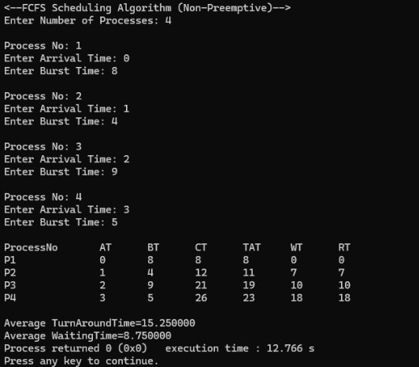
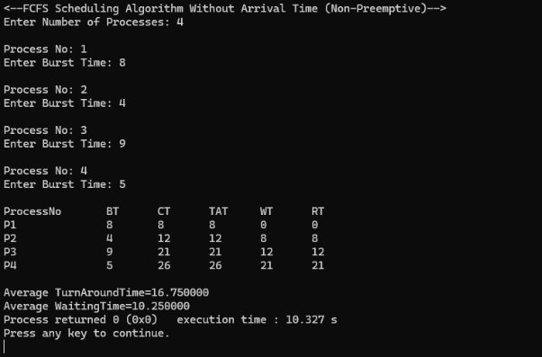

**FCFS Scheduling Algorithm**

```c
#include <stdio.h>

struct proc {
    int no, at, bt, ct, tat, wt;
};

struct proc read(int i) {
    struct proc p;
    printf("\nProcess No: %d\n", i);
    p.no = i;
    printf("Enter Arrival Time: "); scanf("%d", &p.at);
    printf("Enter Burst Time: "); scanf("%d", &p.bt);
    return p;
}

int main() {
    struct proc p[10], tmp;
    float avgtat = 0, avgwt = 0;
    int n, ct = 0;

    printf("<--FCFS Scheduling Algorithm (Non-Preemptive)-->\n");
    printf("Enter Number of Processes: ");
    scanf("%d", &n);

    for (int i = 0; i < n; i++)
        p[i] = read(i + 1);

    for (int i = 0; i < n - 1; i++)
        for (int j = 0; j < n - i - 1; j++)
            if (p[j].at > p[j + 1].at) {
                tmp = p[j]; p[j] = p[j + 1]; p[j + 1] = tmp;
            }

    printf("\nProcessNo\tAT\tBT\tCT\tTAT\tWT\tRT\n");
    for (int i = 0; i < n; i++) {
        ct = (ct > p[i].at) ? ct : p[i].at;
        ct += p[i].bt;
        p[i].ct = ct;
        p[i].tat = p[i].ct - p[i].at;
        avgtat += p[i].tat;
        p[i].wt = p[i].tat - p[i].bt;
        avgwt += p[i].wt;
        printf("P%d\t\t%d\t%d\t%d\t%d\t%d\t%d\n", p[i].no, p[i].at,
               p[i].bt, p[i].ct, p[i].tat, p[i].wt, p[i].wt);
    }

    avgtat /= n, avgwt /= n;

    printf("\nAverage TurnAroundTime=%f\nAverage WaitingTime=%f", avgtat, avgwt);

    return 0;
}
```

**Data Input**

Pada bagian input, kami memasukkan 4 proses dengan Arrival Time (AT) dan Burst Time (BT) sebagai berikut:

1. Proses 1: Arrival Time = 0, Burst Time = 8
2. Proses 2: Arrival Time = 1, Burst Time = 4
3. Proses 3: Arrival Time = 2, Burst Time = 9
4. Proses 4: Arrival Time = 3, Burst Time = 5

**Output**



**Analisa**

**Gantt Chart**

| P1 | P2 | P3 | P4 | 
| -- | -- | -- | -- | 
| 0  | 8  | 12 | 21 |

**Proses yang Terlibat:**

* P1 (Process 1)
* P2 (Process 2)
* P3 (Process 3)
* P4 (Process 4)

Berdasarkan algoritma FCFS yang bersifat non-preemptive, proses dijalankan sesuai urutan kedatangan tanpa interupsi:

* P1 datang paling awal (waktu 0), langsung dieksekusi hingga selesai (waktu 8).
* P2 datang waktu 1, mulai dieksekusi setelah P1 selesai (waktu 8) hingga selesai di waktu 12.
* P3 datang waktu 2, mulai di waktu 12, selesai di waktu 21.
* P4 datang waktu 3, mulai di waktu 21, selesai di waktu 26.

| Proses No | AT | BT | CT | TAT | WT | RT |
| --------- | -- | -- | -- | --- | -- | -- |
| P1        | 0  | 8  | 8  | 8   | 0  | 0  |
| P2        | 1  | 4  | 12 | 11  | 7  | 7  |
| P3        | 2  | 9  | 21 | 19  | 10 | 10 |
| P4        | 3  | 5  | 26 | 23  | 18 | 18 |

---

### Proses Pengurutan Berdasarkan Arrival Time (AT)

Setelah data dimasukkan, algoritma FCFS mengurutkan proses-proses berdasarkan Arrival Time secara ascending:

* Proses 1 datang pertama pada waktu 0.
* Proses 2 datang berikutnya pada waktu 1.
* Proses 3 datang pada waktu 2.
* Proses 4 datang pada waktu 3.

Urutan yang sudah terurut berdasarkan Arrival Time adalah: **P1, P2, P3, P4**.

---

### Perhitungan Completion Time (CT), Turnaround Time (TAT), Waiting Time (WT)

#### 1. Proses 1 (P1):

* **Arrival Time (AT):** 0
* **Burst Time (BT):** 8
* **Completion Time (CT):** P1 mulai pada waktu 0, selesai setelah 8 unit waktu, sehingga CT = 8.
* **Turnaround Time (TAT):** TAT = CT - AT = 8 - 0 = 8
* **Waiting Time (WT):** WT = TAT - BT = 8 - 8 = 0
* **Response Time (RT):** RT = WT = 0

#### 2. Proses 2 (P2):

* **Arrival Time (AT):** 1
* **Burst Time (BT):** 4
* **Completion Time (CT):** P2 mulai setelah P1 selesai, jadi CT = 8 + 4 = 12
* **Turnaround Time (TAT):** TAT = CT - AT = 12 - 1 = 11
* **Waiting Time (WT):** WT = TAT - BT = 11 - 4 = 7
* **Response Time (RT):** RT = WT = 7

#### 3. Proses 3 (P3):

* **Arrival Time (AT):** 2
* **Burst Time (BT):** 9
* **Completion Time (CT):** P3 mulai setelah P2 selesai, jadi CT = 12 + 9 = 21
* **Turnaround Time (TAT):** TAT = CT - AT = 21 - 2 = 19
* **Waiting Time (WT):** WT = TAT - BT = 19 - 9 = 10
* **Response Time (RT):** RT = WT = 10

#### 4. Proses 4 (P4):

* **Arrival Time (AT):** 3
* **Burst Time (BT):** 5
* **Completion Time (CT):** P4 mulai setelah P3 selesai, jadi CT = 21 + 5 = 26
* **Turnaround Time (TAT):** TAT = CT - AT = 26 - 3 = 23
* **Waiting Time (WT):** WT = TAT - BT = 23 - 5 = 18
* **Response Time (RT):** RT = WT = 18

---

### Analisis Rata-Rata

* **Average Turnaround Time (TAT):**
  Rata-rata waktu yang dibutuhkan proses untuk menjalani eksekusi dari kedatangan hingga selesai.
  Dihitung sebagai:
  Average TAT = (8 + 11 + 19 + 23) / 4 = **15.25**

* **Average Waiting Time (WT):**
  Rata-rata waktu tunggu proses dalam antrean sebelum dieksekusi.
  Dihitung sebagai:
  Average WT = (0 + 7 + 10 + 18) / 4 = **8.75**

---

### Pembahasan Output

1. **Turnaround Time (TAT):**
   Turnaround Time menunjukkan waktu total yang dibutuhkan dari kedatangan proses hingga selesai. Rata-rata Turnaround Time adalah **15.25**, artinya setiap proses memerlukan waktu sekitar 15.25 satuan waktu untuk menjalani seluruh siklus eksekusinya.

2. **Waiting Time (WT):**
   Waiting Time mencerminkan lamanya proses menunggu giliran sebelum dieksekusi. Dengan rata-rata **8.75**, ini berarti proses-proses tersebut rata-rata menunggu sekitar 8.75 satuan waktu sebelum dimulai.

3. **Response Time (RT):**
   Karena algoritma FCFS bersifat non-preemptive, maka Response Time sama dengan Waiting Time. Waktu respons ini menunjukkan durasi sejak proses datang hingga mulai dijalankan, tanpa gangguan dari proses lain.

---

**FCFS Scheduling Algorithm Without Arrival Time**

```c
#include <stdio.h>

struct proc {
    int no, bt, ct, tat, wt;
};

struct proc read(int i) {
    struct proc p;
    printf("\nProcess No: %d\n", i);
    p.no = i;
    printf("Enter Burst Time: "); scanf("%d", &p.bt);
    return p;
}

int main() {
    struct proc p[10];
    float avgtat = 0, avgwt = 0;
    int n, ct = 0;

    printf("<--FCFS Scheduling Algorithm Without Arrival Time (Non-Preemptive)-->\n");
    printf("Enter Number of Processes: ");
    scanf("%d", &n);

    for (int i = 0; i < n; i++)
        p[i] = read(i + 1);

    printf("\nProcessNo\tBT\tCT\tTAT\tWT\tRT\n");
    for (int i = 0; i < n; i++) {
        ct += p[i].bt;
        p[i].ct = ct; p[i].tat = ct;
        avgtat += p[i].tat;
        p[i].wt = p[i].tat - p[i].bt;
        avgwt += p[i].wt;
        printf("P%d\t\t%d\t%d\t%d\t%d\t%d\n", p[i].no,
               p[i].bt, p[i].ct, p[i].tat, p[i].wt, p[i].wt);
    }

    avgtat /= n, avgwt /= n;
    printf("\nAverage TurnAroundTime=%f\nAverage WaitingTime=%f", avgtat, avgwt);

    return 0;
}
```

**Data Input**

* P1: BT = 8
* P2: BT = 4
* P3: BT = 9
* P4: BT = 5

**Output**



**Analisa**

**Gantt Chart**

| P1 | P2 | P3 | P4 |    |
| -- | -- | -- | -- | -- |
| 0  | 8  | 12 | 21 | 26 |

| Proses No | BT | CT | TAT | WT | RT |
| --------- | -- | -- | --- | -- | -- |
| P1        | 8  | 8  | 8   | 0  | 0  |
| P2        | 4  | 12 | 12  | 8  | 8  |
| P3        | 9  | 21 | 21  | 12 | 12 |
| P4        | 5  | 26 | 26  | 21 | 21 |

Perhitungan:
Karena Arrival Time tidak digunakan dalam algoritma ini, proses dihitung berdasarkan urutan yang diberikan dan dilaksanakan secara berurutan, tanpa preemption.

**Proses Perhitungan:**

1. Proses P1:

   * Burst Time (BT) = 8
   * Completion Time (CT): P1 dimulai pada waktu 0 dan selesai pada waktu 8 (CT = 8).
   * Turnaround Time (TAT): TAT = CT - AT = 8 - 0 = 8 (karena tidak ada Arrival Time).
   * Waiting Time (WT): WT = TAT - BT = 8 - 8 = 0.
   * Response Time (RT): RT = WT = 0.

2. Proses P2:

   * Burst Time (BT) = 4
   * Completion Time (CT): P2 dimulai setelah P1 selesai pada waktu 8, dan selesai pada waktu 12 (CT = 12).
   * Turnaround Time (TAT): TAT = CT - AT = 12 - 0 = 12 (karena tidak ada Arrival Time).
   * Waiting Time (WT): WT = TAT - BT = 12 - 4 = 8.
   * Response Time (RT): RT = WT = 8.

3. Proses P3:

   * Burst Time (BT) = 9
   * Completion Time (CT): P3 dimulai setelah P2 selesai pada waktu 12, dan selesai pada waktu 21 (CT = 21).
   * Turnaround Time (TAT): TAT = CT - AT = 21 - 0 = 21 (karena tidak ada Arrival Time).
   * Waiting Time (WT): WT = TAT - BT = 21 - 9 = 12.
   * Response Time (RT): RT = WT = 12.

4. Proses P4:

   * Burst Time (BT) = 5
   * Completion Time (CT): P4 dimulai setelah P3 selesai pada waktu 21, dan selesai pada waktu 26 (CT = 26).
   * Turnaround Time (TAT): TAT = CT - AT = 26 - 0 = 26 (karena tidak ada Arrival Time).
   * Waiting Time (WT): WT = TAT - BT = 26 - 5 = 21.
   * Response Time (RT): RT = WT = 21.

**Perhitungan Rata-Rata**

* Average Turnaround Time (TAT): Average TAT = (8 + 12 + 21 + 26) / 4 = 16.75
* Average Waiting Time (WT): Average WT = (0 + 8 + 12 + 21) / 4 = 10.25

**Penjelasan Tentang Output:**

1. Proses P1:

   * Burst Time = 8. Proses ini dieksekusi pertama kali dan selesai pada waktu 8. Tidak ada waktu tunggu atau waktu respons (karena ini adalah proses pertama), sehingga Waiting Time dan Response Time keduanya adalah 0.

2. Proses P2:

   * Burst Time = 4. Proses ini dimulai setelah P1 selesai (pada waktu 8), dan selesai pada waktu 12.
   * Turnaround Time (TAT) adalah waktu dari kedatangan (dalam hal ini, waktu 0) hingga proses selesai, yaitu 12.
   * Waiting Time (WT) adalah waktu yang dihabiskan proses dalam antrean, yaitu 12 - 4 = 8 satuan waktu.

3. Proses P3:

   * Burst Time = 9. Proses ini dimulai setelah P2 selesai (pada waktu 12), dan selesai pada waktu 21.
   * Turnaround Time (TAT) adalah 21 satuan waktu, dan Waiting Time (WT) adalah 21 - 9 = 12.

4. Proses P4:

   * Burst Time = 5. Proses ini dimulai setelah P3 selesai (pada waktu 21), dan selesai pada waktu 26.
   * Turnaround Time (TAT) adalah 26 satuan waktu, dan Waiting Time (WT) adalah 26 - 5 = 21.

**Rata-Rata:**

* Average Turnaround Time = 16.75, yang menunjukkan bahwa rata-rata proses membutuhkan 16.75 satuan waktu untuk selesai dari kedatangan hingga penyelesaian.
* Average Waiting Time = 10.25, yang berarti rata-rata proses menunggu selama 10.25 satuan waktu sebelum mulai dieksekusi.
