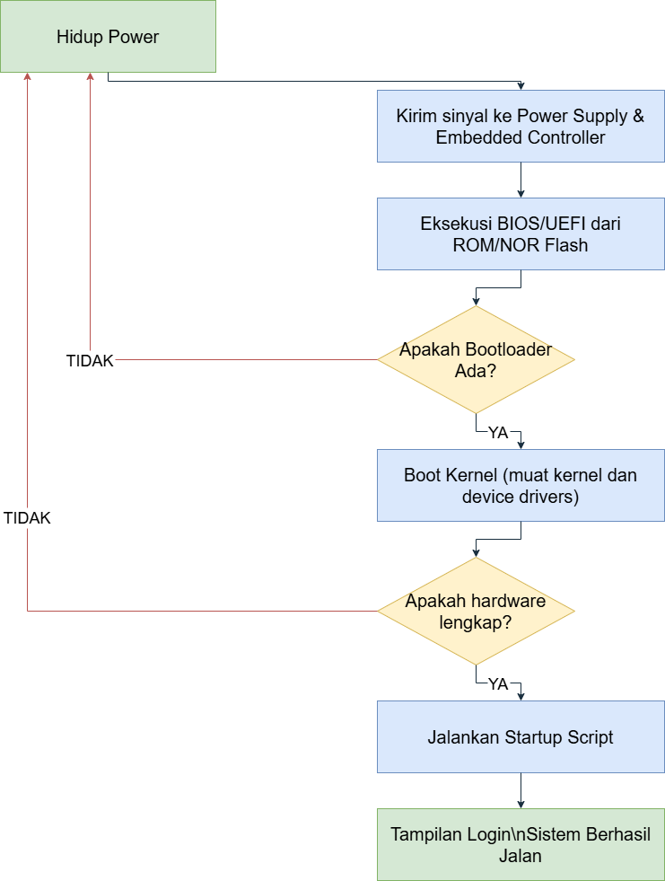

# Flowchart Booting Sistem

Dokumentasi ini menjelaskan proses booting sistem yang divisualisasikan melalui flowchart beserta penjelasan masing-masing langkah.

## Informasi Proyek

- **Nama:** Sulistyo Fajar Pratama
- **NRP:** 3124500037
- **Kelas:** D3-TI-3C      
- **Dosen Pengajar:** Dr Ferry Astika Saputra ST, M.Sc

## Diagram Flowchart

Berikut adalah diagram flowchart yang menggambarkan proses booting sistem:

## Penjelasan Langkah-Langkah

1. **Hidup Power**  
   Proses booting dimulai dengan mengaktifkan power pada sistem. Ini merupakan langkah awal agar komputer mendapatkan pasokan daya.

2. **Kirim Sinyal ke Power Supply & Embedded Controller**  
   Setelah mendapatkan daya, sistem mengirimkan sinyal ke power supply dan embedded controller untuk memastikan semua komponen utama menerima daya yang diperlukan.

3. **Eksekusi BIOS/UEFI dari ROM/NOR Flash**  
   CPU mulai mengeksekusi BIOS/UEFI yang tersimpan di ROM atau NOR flash memory. BIOS/UEFI melakukan Power-On Self Test (POST) untuk memeriksa kondisi perangkat keras dan memastikan semuanya berfungsi dengan baik.

4. **Cek Bootloader (Apakah Bootloader Ada?)**  
   BIOS/UEFI mencari bootloader, yang merupakan program penting untuk:
   - **Memuat kernel** sistem operasi ke dalam memori.
   - **Menginisialisasi modul-modul penting** seperti device drivers dan libraries.  
   **Keputusan:**  
   - **YA:** Proses berlanjut ke tahap boot kernel.  
   - **TIDAK:** Sistem gagal melanjutkan booting karena tidak dapat memuat kernel.

5. **Boot Kernel**  
   Jika bootloader ditemukan, sistem akan mengalokasikan RAM untuk kernel dan memuat kernel beserta modul-modul yang diperlukan, sehingga sistem operasi dapat berjalan.

6. **Cek Hardware Lengkap (Apakah hardware lengkap?)**  
   Setelah kernel dimuat, sistem memeriksa kelengkapan perangkat keras:
   - **YA:** Proses booting berlanjut.
   - **TIDAK:** Booting gagal karena perangkat keras yang diperlukan tidak tersedia atau bermasalah.

7. **Jalankan Startup Script**  
   Sistem menjalankan startup script (misalnya melalui file init seperti systemd atau wininit.exe, atau file .target) untuk menginisialisasi layanan-layanan dan aplikasi penting agar sistem siap digunakan.

8. **Tampilan Login & Sistem Berhasil Jalan**  
   Setelah seluruh proses inisialisasi selesai, sistem menampilkan tampilan login, menandakan bahwa booting telah berhasil dan sistem siap untuk menerima interaksi pengguna.

---
