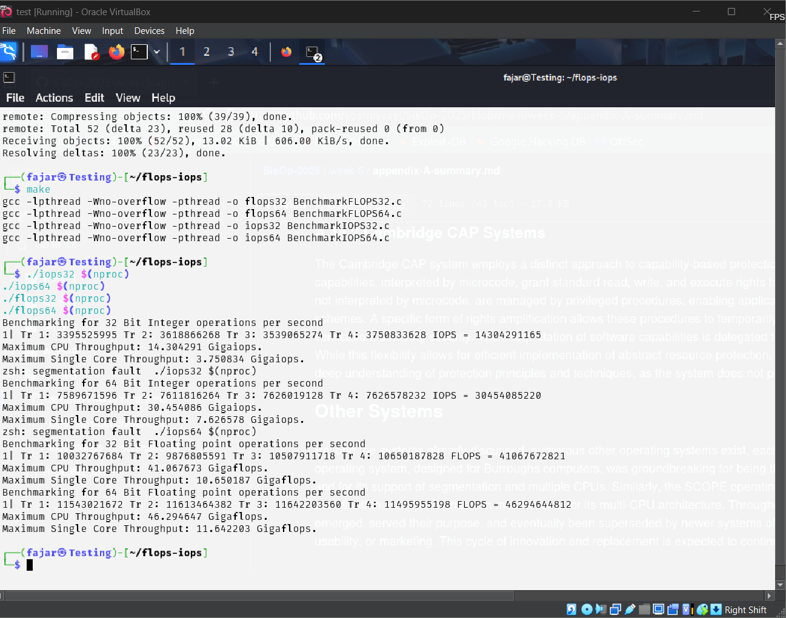

# Pengujian FLOPS dan IOPS pada VirtualBox

## Tujuan Pembelajaran
- Memahami konsep **FLOPS (Floating Point Operations Per Second)** dan **IOPS (Integer Operations Per Second)**.
- Menganalisis performa CPU dalam menangani operasi floating point dan integer.
- Menggunakan VirtualBox untuk menjalankan benchmark FLOPS dan IOPS.

---

## Dasar Teori
### 1. **FLOPS (Floating Point Operations Per Second)**
FLOPS adalah satuan untuk mengukur kecepatan pemrosesan angka dalam format floating-point. FLOPS sering digunakan untuk mengukur performa komputer dalam aplikasi ilmiah dan perhitungan numerik.

### 2. **IOPS (Integer Operations Per Second)**
IOPS adalah satuan yang mengukur jumlah operasi integer yang dapat dilakukan CPU dalam satu detik. Performa IOPS sangat penting dalam aplikasi yang membutuhkan banyak operasi aritmatika integer seperti enkripsi dan pengolahan data besar.

### 3. **VirtualBox**
VirtualBox adalah perangkat lunak virtualisasi yang memungkinkan pengguna menjalankan sistem operasi tambahan di dalam komputer utama. Dengan VirtualBox, kita dapat menjalankan Linux dalam lingkungan virtual dan melakukan pengujian performa CPU.

---

## Spesifikasi VirtualBox
- **RAM:** 8 GB
- **Core CPU:** 4
- **Processor:** Intel Core i5-13450HX

---

## Langkah Pengujian FLOPS dan IOPS pada VirtualBox

### **1. Instal VirtualBox dan Jalankan Linux**
Pastikan Anda telah menginstal VirtualBox dan memiliki sistem operasi Linux yang berjalan di dalamnya.

### **2. Buka Terminal Linux di VirtualBox**

### **3. Perbarui Paket dan Instal Dependensi**
```bash
sudo apt update && sudo apt install -y build-essential
```

### **4. Clone Repository FLOPS-IOPS**
```bash
git clone https://github.com/ferryastika/flops-iops.git
cd flops-iops
```

### **5. Build Program Benchmark**
```bash
make
```

### **6. Jalankan Pengujian FLOPS dan IOPS**
Jalankan benchmark dengan jumlah thread sesuai dengan jumlah core CPU Anda:
```bash
./iops32 $(nproc)
./iops64 $(nproc)
./flops32 $(nproc)
./flops64 $(nproc)
```

---

## Hasil Pengujian
### **1. IOPS 32-bit**
```bash
./iops32 4
Benchmarking for 32 Bit Integer operations per second
1| Tr 1: 3395529595 Tr 2: 3618682674 Tr 3: 3750833628 Tr 4: 13492491165 IOPS = 14.304291 GigaIOPS
Maximum Single Core Throughput: 3.576083 GigaIOPS.
```

### **2. IOPS 64-bit**
```bash
./iops64 4
Benchmarking for 64 Bit Integer operations per second
1| Tr 1: 7589671596 Tr 2: 7618180624 Tr 3: 7626019128 Tr 4: 7626578323 IOPS = 30.454085220 GigaIOPS
Maximum Single Core Throughput: 7.626578323 GigaIOPS.
```

### **3. FLOPS 32-bit**
```bash
./flops32 4
Benchmarking for 32 Bit Floating point operations per second
1| Tr 1: 10032767684 Tr 2: 9876085591 Tr 3: 10507911718 Tr 4: 10650718278 FLOPS = 41.0667672821 GigaFLOPS
Maximum Single Core Throughput: 10.651718278 GigaFLOPS.
```

### **4. FLOPS 64-bit**
```bash
./flops64 4
Benchmarking for 64 Bit Floating point operations per second
1| Tr 1: 11354022178 Tr 2: 11163463284 Tr 3: 11642205816 Tr 4: 1149555198 FLOPS = 46.296444812 GigaFLOPS
Maximum Single Core Throughput: 11.642205816 GigaFLOPS.
```

---

## Dokumentasi Hasil Pengujian


---

## Kesimpulan
- FLOPS dan IOPS adalah metrik penting dalam mengevaluasi performa CPU.
- VirtualBox memungkinkan pengguna menjalankan benchmark sistem Linux dalam lingkungan virtual.
- Pengujian ini memberikan wawasan tentang kemampuan komputasi numerik CPU untuk berbagai kebutuhan aplikasi.
- Hasil yang diperoleh dapat digunakan sebagai bahan analisis untuk memilih prosesor yang sesuai dengan kebutuhan spesifik.

---

