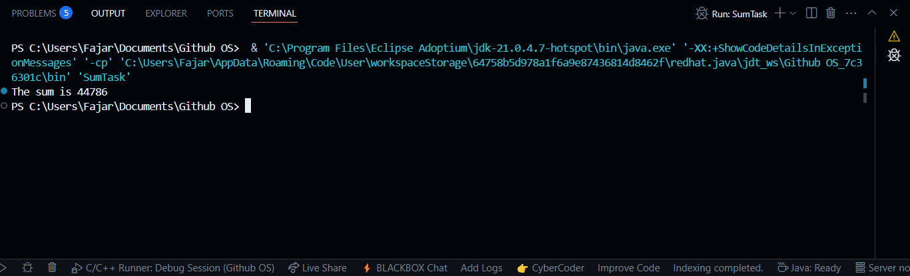
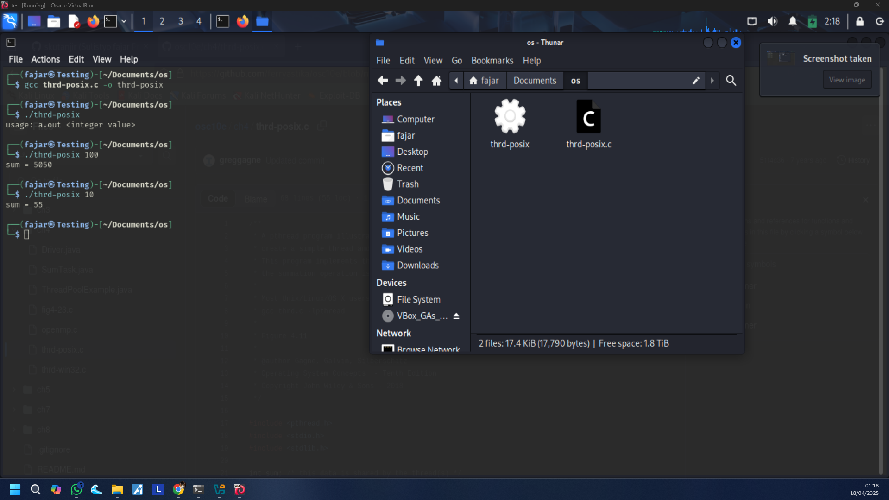
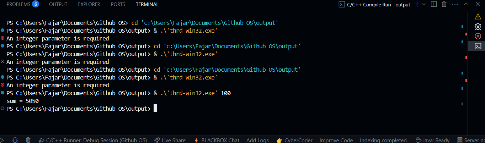

**Nama:** Sulistyo Fajar Pratama  
**NRP:** 3124500037  
**Kelas:** D3 IT B    
**Dosen Pengajar:** Dr Ferry Astika Saputra ST, M.Sc

## **Programming Exercise: Penerapan Threading di Java, Linux, dan Windows**  
### *(Studi Kasus: `SumTask.java`, `thrd-posix.c`, dan `thrd-win32.c`)*

---

## a. Java dengan Fork/Join (SumTask.java)

Ketika harus menjumlahkan 10.000 angka acak, satu thread bisa jadi lambat. Java menyediakan Fork/Join, sebuah pendekatan divide-and-conquer yang otomatis memecah pekerjaan jadi bagian kecil lalu menggabungkan hasilnya secara paralel. Cocok untuk prosesor multicore.

ForkJoinPool bertugas mengelola thread, memakai algoritma *work-stealing* agar beban tersebar merata. SumTask memperluas `RecursiveTask<Integer>` dan mengatur logika pembagian. Jika subtugas lebih kecil dari `THRESHOLD`, langsung dihitung. Jika tidak, dibagi dua dan dijalankan paralel dengan `fork()` dan digabung hasilnya dengan `join()`.

```java
// SumTask.java
import java.util.concurrent.*;

public class SumTask extends RecursiveTask<Integer> {
    static final int SIZE      = 10000;
    static final int THRESHOLD = 1000;

    private int begin, end;
    private int[] array;

    public SumTask(int begin, int end, int[] array) {
        this.begin = begin;
        this.end   = end;
        this.array = array;
    }

    @Override
    protected Integer compute() {
        if (end - begin < THRESHOLD) {
            int sum = 0;
            for (int i = begin; i <= end; i++) {
                sum += array[i];
            }
            return sum;
        } else {
            int mid = begin + (end - begin) / 2;
            SumTask left  = new SumTask(begin, mid, array);
            SumTask right = new SumTask(mid + 1, end, array);

            left.fork();
            right.fork();

            return left.join() + right.join();
        }
    }

    public static void main(String[] args) {
        ForkJoinPool pool = new ForkJoinPool();
        int[] array = new int[SIZE];
        java.util.Random rand = new java.util.Random();

        for (int i = 0; i < SIZE; i++) {
            array[i] = rand.nextInt(10);
        }

        SumTask task = new SumTask(0, SIZE - 1, array);
        int sum = pool.invoke(task);

        System.out.println("The sum is " + sum);
    }
}
```

```bash
javac SumTask.java
java SumTask
```



---

## b. Linux dengan POSIX Threads (thrd-posix.c)

Di sistem Linux, perhitungan bisa dijalankan lewat POSIX Threads (pthreads) yang memberi kontrol manual. `pthread_create` digunakan untuk memulai thread dan `pthread_join` untuk menunggu hingga selesai. Dalam contoh ini, hanya satu thread yang mengakses variabel `sum`, sehingga aman dari race condition.

```c
// thrd-posix.c
#include <pthread.h>
#include <stdio.h>
#include <stdlib.h>

int sum;

void *runner(void *param) {
    int upper = atoi(param);
    sum = 0;
    for (int i = 1; i <= upper; i++) {
        sum += i;
    }
    pthread_exit(0);
}

int main(int argc, char *argv[]) {
    if (argc != 2 || atoi(argv[1]) < 0) {
        fprintf(stderr, "Usage: %s <non-negative integer>\n", argv[0]);
        return -1;
    }
    pthread_t tid;
    pthread_attr_t attr;
    pthread_attr_init(&attr);

    pthread_create(&tid, &attr, runner, argv[1]);
    pthread_join(tid, NULL);

    printf("sum = %d\n", sum);
    return 0;
}
```

```bash
gcc thrd-posix.c -lpthread -o posix_sum
./posix_sum 100
```



---

## c. Windows dengan Win32 API (thrd-win32.c)

Di Windows, threading dikelola dengan `CreateThread` dan `WaitForSingleObject`. Variabel global `Sum` digunakan oleh thread worker. Setelah dijalankan, thread utama akan menunggu sampai selesai, lalu mencetak hasilnya.

```c
// thrd-win32.c
#include <windows.h>
#include <stdio.h>

DWORD Sum;

DWORD WINAPI Summation(PVOID Param) {
    DWORD upper = *(DWORD *)Param;
    Sum = 0;
    for (DWORD i = 0; i <= upper; i++) {
        Sum += i;
    }
    return 0;
}

int main(int argc, char *argv[]) {
    if (argc != 2) {
        fprintf(stderr, "An integer parameter is required\n");
        return -1;
    }
    DWORD Param = atoi(argv[1]);
    if ((int)Param < 0) {
        fprintf(stderr, "An integer >= 0 is required\n");
        return -1;
    }

    DWORD ThreadId;
    HANDLE hThread = CreateThread(
        NULL,
        0,
        Summation,
        &Param,
        0,
        &ThreadId
    );

    if (hThread) {
        WaitForSingleObject(hThread, INFINITE);
        CloseHandle(hThread);
        printf("sum = %lu\n", Sum);
    }
    return 0;
}
```

```bat
cl thrd-win32.c
thrd-win32.exe 100
```



---

Setiap platform punya cara sendiri dalam menangani threading, namun tujuannya sama: mempercepat eksekusi dengan membagi kerja ke beberapa bagian secara paralel.
