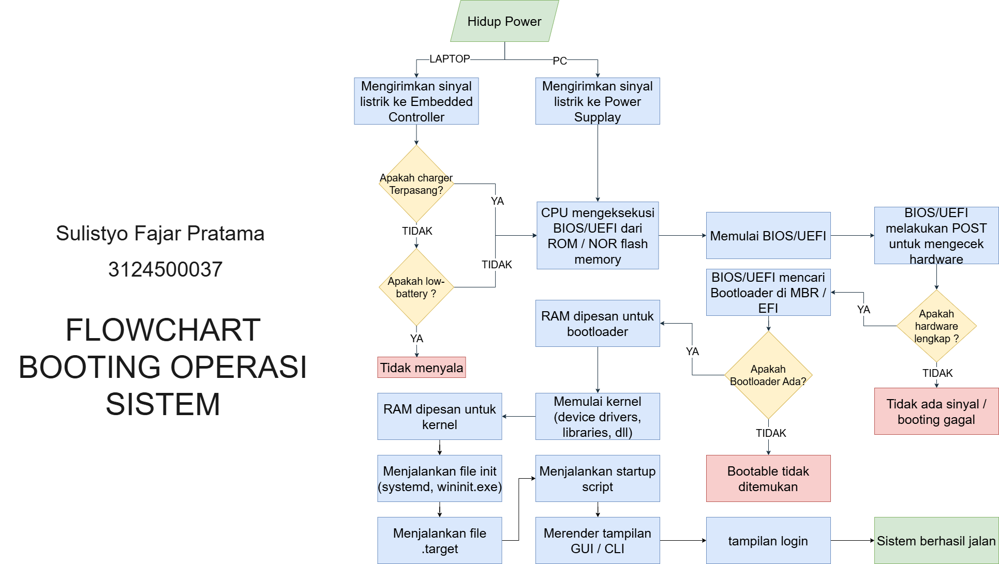

**Nama:** Sulistyo Fajar Pratama  
**NRP:** 3124500037  
**Kelas:** D3 IT B

# Proses Booting: Dari Hidup Power hingga Sistem Berhasil Berjalan

## Langkah-langkah

1. **Hidup Power:**  
   Tombol power ditekan sehingga komputer menerima suplai listrik.

2. **Pemeriksaan Daya:**  
   - *Laptop:* Embedded Controller memeriksa apakah baterai cukup atau charger terpasang.  
   - *PC:* Power supply mulai mendistribusikan listrik ke semua komponen.

3. **Inisialisasi CPU:**  
   CPU mulai bekerja dan mencari firmware (BIOS/UEFI) yang tersimpan di ROM.

4. **Aktivasi BIOS/UEFI:**  
   BIOS/UEFI dijalankan untuk menyiapkan sistem dasar.

5. **POST (Power-On Self Test):**  
   Sistem melakukan pengecekan awal (RAM, CPU, GPU, dsb.) untuk memastikan semua perangkat keras berfungsi.

6. **Mencari Boot Device:**  
   BIOS/UEFI memeriksa perangkat penyimpanan (HDD/SSD, USB) untuk menemukan media bootable.

7. **Menjalankan Bootloader:**  
   Jika perangkat bootable ditemukan, bootloader (misalnya GRUB atau Windows Boot Manager) dijalankan.

8. **Memuat Kernel:**  
   Bootloader memuat kernel sistem operasi ke dalam memori (RAM).

9. **Inisialisasi Kernel:**  
   Kernel mengatur driver perangkat, manajemen memori, dan sistem berkas.

10. **Proses Init:**  
    Kernel menjalankan proses init (seperti systemd) yang akan mengatur layanan sistem.

11. **Menjalankan Layanan Startup:**  
    Layanan penting (networking, logging, display manager, dsb.) aktif untuk menyiapkan lingkungan kerja.

12. **Tampilan Login:**  
    Antarmuka login (GUI atau CLI) muncul dan sistem siap digunakan oleh pengguna.
