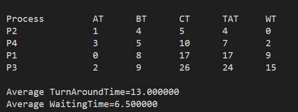

<code>Sulistyo Fajar Pratama 3124500037</code></br>

<code>Ibnu Habib Ridwansyah 3124500041</code></br>

<code>Hafizh Hammas Muntazar 3124500060</code></br>

# **Penjelasan dan Pembahasan Output Algoritma Shortest Remaining Time First (SRTF)**

### **1. Pengenalan SRTF (Shortest Remaining Time First)**

SRTF adalah algoritma penjadwalan preemptive yang digunakan dalam sistem operasi untuk mengatur urutan eksekusi proses berdasarkan waktu eksekusi yang tersisa (remaining time) pada setiap proses. Setiap kali proses baru datang, algoritma ini memilih proses dengan waktu burst (waktu eksekusi) yang tersisa paling sedikit untuk dijalankan. Jika ada proses baru yang tiba dan memiliki waktu burst yang lebih kecil daripada proses yang sedang berjalan, proses yang sedang berjalan akan dihentikan sementara dan digantikan dengan proses baru tersebut.

### **2. Penjelasan Struktur Data**

Pada kode program, terdapat struktur data `proc` yang menyimpan informasi mengenai setiap proses:

* **no**: Nomor proses.
* **at**: Arrival Time (Waktu kedatangan proses).
* **bt**: Burst Time (Waktu eksekusi proses).
* **rt**: Remaining Time (Sisa waktu eksekusi).
* **ct**: Completion Time (Waktu selesai eksekusi).
* **tat**: Turnaround Time (Waktu penyelesaian dari kedatangan hingga selesai).
* **wt**: Waiting Time (Waktu tunggu sebelum proses dieksekusi).

### **3. Kode Program Algoritma SRTF**

```c
#include<stdio.h>
#define MAX 9999

// Struktur data untuk menyimpan informasi proses
struct proc {
    int no, at, bt, rt, ct, tat, wt;
};

// Fungsi untuk membaca input data proses
struct proc read(int i) {
    struct proc p;
    printf("\nProcess No: %d\n", i);
    p.no = i;
    printf("Enter Arrival Time: ");
    scanf("%d", &p.at);
    printf("Enter Burst Time: ");
    scanf("%d", &p.bt);
    p.rt = p.bt;
    return p;
}

int main() {
    struct proc p[10], temp;
    float avgtat = 0, avgwt = 0;
    int n, s, remain = 0, time;
    
    // Menampilkan judul
    printf("<--SRTF Scheduling Algorithm (Preemptive)-->\n");
    printf("Enter Number of Processes: ");
    scanf("%d", &n);

    // Membaca data untuk setiap proses
    for(int i = 0; i < n; i++) 
        p[i] = read(i + 1);

    // Mengurutkan proses berdasarkan Arrival Time (AT)
    for(int i = 0; i < n - 1; i++) 
        for(int j = 0; j < n - i - 1; j++) 
            if(p[j].at > p[j + 1].at) {
                temp = p[j];
                p[j] = p[j + 1];
                p[j + 1] = temp;
            }

    // Menampilkan tabel hasil penjadwalan
    printf("\nProcess\t\tAT\tBT\tCT\tTAT\tWT\n");
    p[9].rt = MAX;

    // Menjalankan proses dengan perhitungan preemptive
    for(time = 0; remain != n; time++) {
        s = 9;
        for(int i = 0; i < n; i++) 
            if(p[i].at <= time && p[i].rt < p[s].rt && p[i].rt > 0) 
                s = i;

        p[s].rt--;
        if(p[s].rt == 0) {
            remain++;
            p[s].ct = time + 1;
            p[s].tat = p[s].ct - p[s].at;
            avgtat += p[s].tat;
            p[s].wt = p[s].tat - p[s].bt;
            avgwt += p[s].wt;

            // Menampilkan hasil setiap proses
            printf("P%d\t\t%d\t%d\t%d\t%d\t%d\n", p[s].no, p[s].at, p[s].bt, p[s].ct, p[s].tat, p[s].wt);
        }
    }

    // Menghitung rata-rata TAT dan WT
    avgtat /= n;
    avgwt /= n;

    // Menampilkan hasil rata-rata
    printf("\nAverage TurnAroundTime = %f\nAverage WaitingTime = %f", avgtat, avgwt);
}
```

### **4. Output**



#### **Penjelasan Tabel Output:**

* **Process**: Menunjukkan nomor dari proses yang dijalankan.
* **AT (Arrival Time)**: Waktu kedatangan setiap proses di sistem.
* **BT (Burst Time)**: Waktu yang dibutuhkan oleh setiap proses untuk dieksekusi.
* **CT (Completion Time)**: Waktu ketika proses selesai eksekusi.
* **TAT (Turnaround Time)**: Waktu yang dibutuhkan untuk menyelesaikan proses, dihitung dengan rumus:

  $$
  TAT = CT - AT
  $$
* **WT (Waiting Time)**: Waktu tunggu sebuah proses sebelum mulai dieksekusi, dihitung dengan rumus:

  $$
  WT = TAT - BT
  $$

#### **Proses Eksekusi Berdasarkan Output:**

1. **P2**:

   * **Arrival Time (AT)**: 1, **Burst Time (BT)**: 4.
   * **Completion Time (CT)**: 5, **Turnaround Time (TAT)**: 5 - 1 = 4, **Waiting Time (WT)**: 4 - 4 = 0.

2. **P4**:

   * **Arrival Time (AT)**: 3, **Burst Time (BT)**: 5.
   * **Completion Time (CT)**: 10, **Turnaround Time (TAT)**: 10 - 3 = 7, **Waiting Time (WT)**: 7 - 5 = 2.

3. **P1**:

   * **Arrival Time (AT)**: 0, **Burst Time (BT)**: 8.
   * **Completion Time (CT)**: 17, **Turnaround Time (TAT)**: 17 - 0 = 17, **Waiting Time (WT)**: 17 - 8 = 9.

4. **P3**:

   * **Arrival Time (AT)**: 2, **Burst Time (BT)**: 9.
   * **Completion Time (CT)**: 26, **Turnaround Time (TAT)**: 26 - 2 = 24, **Waiting Time (WT)**: 24 - 9 = 15.

#### **Rata-rata TAT dan WT**


### **5. Kelebihan dan Kekurangan Algoritma SRTF**

#### **Kelebihan:**

1. **Mengurangi Waktu Tunggu Rata-Rata**: SRTF cenderung menghasilkan waktu tunggu rata-rata yang lebih rendah dibandingkan algoritma lainnya karena proses dengan waktu eksekusi yang lebih kecil selalu diutamakan.
2. **Responsif terhadap Proses Baru**: Algoritma ini cepat merespons proses baru yang datang dengan waktu eksekusi lebih kecil, karena proses tersebut akan segera dieksekusi meskipun proses lain sedang berjalan.
3. **Efisiensi dalam Kondisi Beban Kerja Tinggi**: Dalam sistem dengan banyak proses dengan waktu eksekusi yang bervariasi, SRTF akan cenderung memilih proses yang lebih cepat selesai, sehingga meningkatkan throughput keseluruhan.

#### **Kekurangan:**

1. **Starvation**: Proses dengan waktu eksekusi yang lebih besar cenderung terabaikan jika terus-menerus ada proses dengan waktu burst lebih kecil. Ini disebut starvation, di mana beberapa proses mungkin tidak pernah mendapatkan kesempatan untuk dieksekusi.
2. **Overhead yang Tinggi**: Karena sifatnya yang preemptive, SRTF memerlukan lebih banyak overhead dalam pengelolaan proses, misalnya, untuk memeriksa ulang proses yang tersedia setiap waktu dan mengganti proses yang sedang berjalan.
3. **Kompleksitas Implementasi**: Implementasi SRTF lebih kompleks dibandingkan dengan algoritma penjadwalan non-preemptive lainnya seperti FCFS (First Come First Serve) atau SJF (Shortest Job First), karena melibatkan pengecekan ulang setiap waktu yang akan menambah beban kerja sistem.
4. **Keterbatasan dalam Situasi Real-Time**: Dalam beberapa sistem real-time, di mana waktu respons yang cepat sangat penting, SRTF mungkin tidak selalu cocok karena sering terjadi pemutusan eksekusi proses yang sedang berjalan.

### **6. Kesimpulan**

Algoritma **Shortest Remaining Time First (SRTF)** adalah algoritma preemptive yang sangat efisien dalam mengurangi waktu tunggu rata-rata. Meskipun demikian, algoritma ini memiliki kekurangan terkait dengan starvation dan overhead yang lebih tinggi dalam implementasinya. Secara keseluruhan, SRTF sangat berguna di lingkungan dengan beban kerja yang bervariasi, namun perlu hati-hati dalam penggunaannya agar tidak menimbulkan masalah bagi proses dengan waktu burst yang lebih besar.
