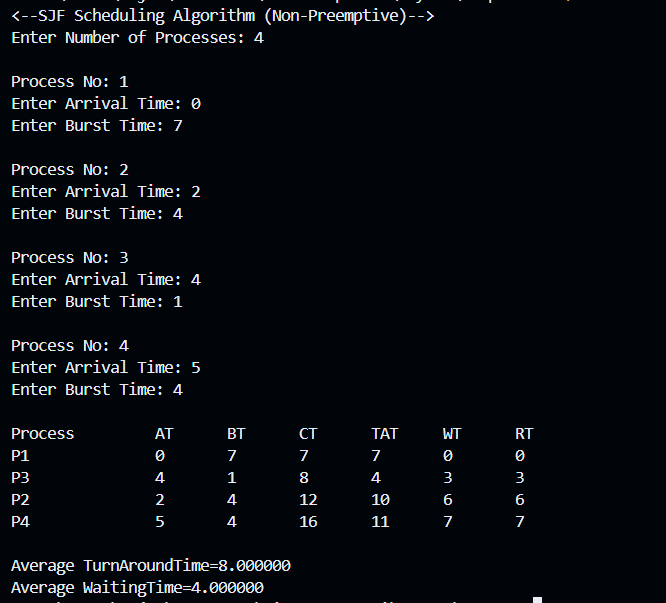

<code>Sulistyo Fajar Pratama 3124500037</code></br>

<code>Ibnu Habib Ridwansyah 3124500041</code></br>

<code>Hafizh Hammas Muntazar 3124500060</code></br>

# Analisis dan Pembahasan Algoritma SJF Non-Preemptive Dengan Arrival Time


Pada varian **SJF Non-Preemptive dengan Arrival Time**, setiap proses memiliki waktu kedatangan (*arrival time*). Scheduler selalu memilih proses terpendek yang telah tiba (arrival ≤ current time) dan belum dieksekusi. Jika tidak ada proses yang siap, CPU menganggur hingga proses berikutnya tiba.

## 1. Kode Program

```c
#include<stdio.h>

struct proc {
    int no, at, bt, it, ct, tat, wt;
};

struct proc read(int i) {
    struct proc p;
    printf("\nProcess No: %d\n", i);
    p.no = i;
    printf("Enter Arrival Time: ");
    scanf("%d", &p.at);
    printf("Enter Burst Time: ");
    scanf("%d", &p.bt);
    return p;
}

int main() {
    int n, j, min=0;
    float avgtat=0, avgwt=0;
    struct proc p[10], temp;

    printf("<-- SJF Scheduling Algorithm (Non-Preemptive With Arrival Time) -->\n");
    printf("Enter Number of Processes: ");
    scanf("%d", &n);

    // 2.1 Input proses
    for(int i=0; i<n; i++)
        p[i] = read(i+1);

    // 2.2 Urutkan berdasarkan arrival time (meningkat)
    for(int i=0; i<n-1; i++)
        for(j=0; j<n-i-1; j++) {
            if(p[j].at > p[j+1].at) {
                temp = p[j]; p[j] = p[j+1]; p[j+1] = temp;
            }
        }

    // 2.3 Pilih proses pertama terpendek pada arrival time sama
    for(j=1; j<n && p[j].at == p[0].at; j++)
        if(p[j].bt < p[min].bt) min = j;
    temp = p[0]; p[0] = p[min]; p[min] = temp;

    // 2.4 Inisialisasi untuk proses pertama
    p[0].it = p[0].at;
    p[0].ct = p[0].it + p[0].bt;

    // 2.5 Penjadwalan sisa proses
    for(int i=1; i<n; i++) {
        // cari proses terpendek yang sudah tiba sebelum CT sebelumnya
        for(j=i+1, min=i; j<n && p[j].at <= p[i-1].ct; j++) {
            if(p[j].bt < p[min].bt) min = j;
        }
        temp = p[i]; p[i] = p[min]; p[min] = temp;

        // tentukan idle time atau langsung
        if(p[i].at <= p[i-1].ct)
            p[i].it = p[i-1].ct;
        else
            p[i].it = p[i].at;

        p[i].ct = p[i].it + p[i].bt;
    }

    // 2.6 Output dan perhitungan
    printf("\nProcess\tAT\tBT\tCT\tTAT\tWT\tRT\n");
    for(int i=0; i<n; i++) {
        p[i].tat = p[i].ct - p[i].at;
        p[i].wt  = p[i].tat - p[i].bt;
        avgtat   += p[i].tat;
        avgwt    += p[i].wt;
        printf("P%d\t\t%d\t%d\t%d\t%d\t%d\t%d\n",
               p[i].no, p[i].at, p[i].bt,
               p[i].ct, p[i].tat, p[i].wt, p[i].wt);
    }
    avgtat /= n; avgwt /= n;
    printf("\nAverage TurnAroundTime = %.2f\n", avgtat);
    printf("Average WaitingTime    = %.2f\n", avgwt);
    return 0;
}
```

## 2. Output Program



## 3. Analisis Hasil

| Proses |  AT |  BT |  CT | TAT = CT-AT | WT = TAT-BT | RT = WT |
| :----: | :-: | :-: | :-: | :---------: | :---------: | :-----: |
|   P1   |  0  |  7  |  7  |      7      |      0      |    0    |
|   P3   |  4  |  1  |  8  |      4      |      3      |    3    |
|   P2   |  2  |  4  |  12 |      10     |      6      |    6    |
|   P4   |  5  |  4  |  16 |      11     |      7      |    7    |

* **Average TAT** = (7 + 4 + 10 + 11) / 4 = 8.00
* **Average WT**  = (0 + 3 + 6 + 7)  / 4 = 4.00

## 4. Kompleksitas dan Pertimbangan

* **Pengurutan Arrival Time:** O(n²) – bubble sort.
* **Pemilihan Proses:** Loop nested untuk mencari BT terpendek di antara yang siap → O(n²) total.
* **Perhitungan Waktu:** O(n).

## 5. Kelebihan dan Kekurangan

| Aspek               | Kelebihan                                                                   | Kekurangan                                                             |
| ------------------- | --------------------------------------------------------------------------- | ---------------------------------------------------------------------- |
| Akurasi Penjadwalan | Mempertimbangkan kedatangan proses, sehingga realistis untuk kasus dinamis. | Lebih kompleks: perlu cek arrival sebelum memilih proses berikutnya.   |
| Efisiensi Waktu     | Optimal meminimalkan waiting time setelah arrival setiap batch.             | O(n²) dalam pemilihan dan pengurutan — kurang cocok untuk skala besar. |
| Idle Time Handling  | Menangani interval idle jika tidak ada proses siap dieksekusi.              | Bisa ada periode idle yang tidak dioptimalkan.                         |
| Implementasi        | Cukup mudah dimodifikasi dari versi tanpa arrival.                          | Logika lebih panjang; rawan bug pada edge case arrival sama/berbeda.   |

## 6. Kesimpulan

Implementasi SJF Non-Preemptive dengan Arrival Time ini berhasil mengakomodasi waktu kedatangan dinamis, menghasilkan average TAT = 8.00 dan average WT = 4.00 untuk data contoh. Untuk peningkatan, dapat dioptimalkan menggunakan struktur data seperti min-heap atau priority queue agar kompleksitas turun ke O(n log n).
